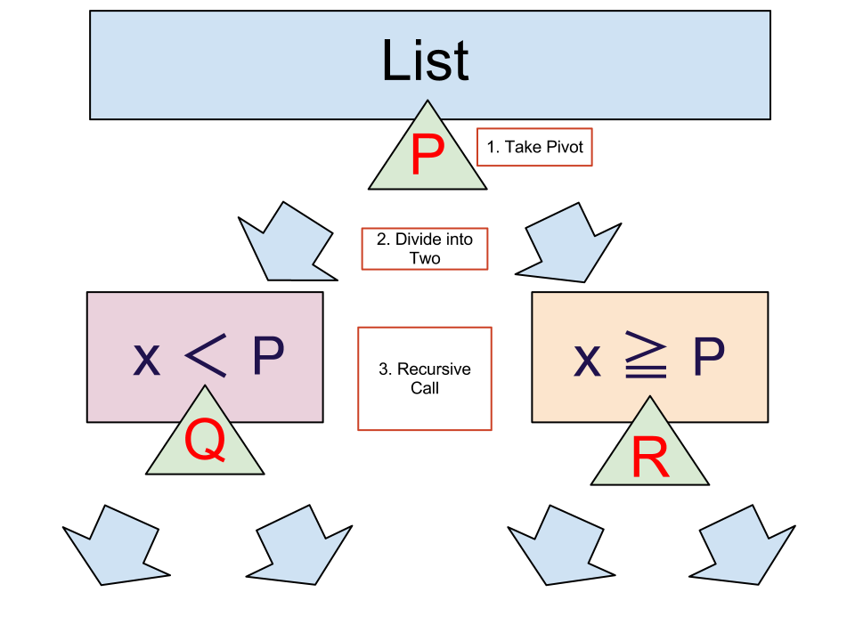

クイックソート
======================

:date: 2012/10/17

.. contents:: 目次
      :local:
      :depth: 2
      :backlinks: top

0. 問題
---------

リスト [3, 2, 5, 4, 1] の要素を並べ替えて、[1, 2, 3, 4, 5] にする、効率の良い手順を考えましょう。

並べ替えをする際にに許される操作は、

::

   1. 要素をリストのどこかに挿入する
   2. 2つの要素を比較する
   3. 2つの要素を入れ替える

ということにしましょう

1. バブルソート
----------------

まず、素朴な方法を考えます。

先頭から順番に隣の要素と比較して、大きい要素を後ろに持っていってみます。

1-1. やってみる
^^^^^^^^^^^^^^^^^^^^^

[3, 2, 5, 4, 1] に対して、

| a. 先頭 の 3, 2 を比較して、3 の方が大きいので、入れ替える
|    →  [2, 3, 5, 4, 1]
| b. 2番目の 3, 5 を比較して、3 の方が小さいので、そのまま
|    →  [2, 3, 5, 4, 1]
| c. 3番目の 5, 4 を比較して、5 の方が大きいので、入れ替える
|    →  [2, 3, 4, 5, 1]
| d. 4番目の 5, 1 を比較して、5 の方が大きいので、入れ替える
|    →  [2, 3, 4, 1, 5]

ここまでで、最も大きい要素である、5 が最後尾に来ました。
同じようにして、もう1度同じ操作を行えば、4 が後ろから2番目に来ます。実際、

| a. 先頭 の 2, 3 を比較して、2 の方が小さいので、そのまま
|    → [2, 3, 4, 1, 5]
| b. 2番目の 3, 4 を比較して、3 の方が小さいので、そのまま
|    → [2, 3, 4, 1, 5]
| c. 3番目の 4, 1 を比較して、4 の方が大きいので、入れ替える
|    → [2, 3, 1, 4, 5]
| d. 4番目の 4, 5 を比較して、4 の方が小さいので、そのまま
|    → [2, 3, 1, 4, 5]

となります。
さらにもう1度同じ操作を行えば、3 が後ろから3番目になります。
このようにして、最終的に、[1, 2, 3, 4, 5] というリストを得ることができます。

このソートの方法をバブルソートというようです。

1-2. 実装
^^^^^^^^^^^^

1. Haskell での実装例

.. code-block:: haskell

   bubble_step :: (Ord a) => [a] -> [a]
   bubble_step (x:[]) = x:[]
   bubble_step (x:y:xs)
      | x > y = y:bubble_step(x:xs)
      | otherwise = x:bubble_step(y:xs)

   bubble :: (Ord a) => [a] -> [a]
   bubble xs = iterate bubble_step xs !! length xs

2. Ruby での実装例

.. code-block:: ruby

   class Bubblesort < Array
     def bubble
       for j in 0...self.length-1
         for i in 0...self.length-1
           self[i], self[i+1] = self[i+1], self[i] if self[i] > self [i+1]
         end
       end
       return self
     end
   end

1-3. 反省
^^^^^^^^^^^^^^^

この方法で、何回要素を比較しないといけないか考えてみます。
1つの要素を後ろに持っていくのに、上の a-d の4回必要でした。
今、要素は 1~5 の5つあるので、リストを並べ終えるまでに、 :math:`4\times5=20` 回も要素を比較する必要があります。

もし、もっと大きなリストを考えていた場合、
サイズ N のリストに対して、 a-d に対応する操作は、 N-1 回必要で、
要素が N 個あるので、 :math:`N\times(N-1)` 回も要素を比較しなければなりません。

(実際には、 :math:`\frac{N\times(N-1)}{2}` くらいまで減らせる。)

2. クイックソート
-------------------------

次に、クイックソートと呼ばれるもう少し効率の良いソート方法を実装します。

2-0. クイックソートとは
^^^^^^^^^^^^^^^^^^^^^^^^^^

クイックソートの戦略は次の通りです。

| 1. 要素を1つ適当に取り出す(ピボット)
| 2. リストを、その要素より小さいものと、その要素以上のもの、の2つに分割する。
| 3. 分割された各リストそれぞれに対して、再び1. を行い、以下繰り返し。

図にしてみるとこんな感じ。

2-1. やってみる
^^^^^^^^^^^^^^^^^^

ここでは、ピボットとしてリストの先頭要素を取る場合を考えてみます。

[3, 2, 5, 4, 1] に対して、

| A. 先頭要素 3 を取り、リストの要素と3を比較する。すると次の2つのリストを得る。
|      [2, 1] : 3より小さい要素からなるリスト
|      [5, 4] : 3以上の要素からなるリスト

.. graphviz::

   digraph qicksortGraph1 {
      graph [size="3.0, 12.0", label = "After A"];
     "3" [shape = triangle];
     "[2, 1]" [shape=box];
     "[5, 4]" [shape=box];

     "3" -> "[2, 1]";
     "3" -> "[5, 4]";
   }

| B-1. [2, 1] に対して、先頭要素 2 を取り、リスト要素と2を比較する。次の2つのリストを得る。
|        [1] : 2より小さい要素からなるリスト
|        []  : 2より大きい要素からなるリスト
| B-2. [5, 4] に対して、先頭要素 5 を取り、リスト要素と2を比較する。次の2つのリストを得る。
|        [4] : 5より小さい要素からなるリスト
|        []  : 5より大きい要素からなるリスト

.. graphviz::

   digraph qicksortGraph2 {
      graph [size="3.0, 12.0", label = "After B"];
     "3" [shape = triangle];

     subgraph class1 {
       "3" -> "[2, 1]";
       "3" -> "[5, 4]";
     }
     subgraph class2 {
       "2" [shape = triangle];
       "[1]" [shape = box];
       X [shape = box, label="[]"];
       "[2, 1]" -> "2" [arrowhead = none];
       "2" -> X;
       "2" -> "[1]";
     }
     subgraph class3 {
       "5" [shape = triangle];
       "[4]" [shape = box];
       Y [shape = box, label="[]"];
       "[5, 4]" -> "5" [arrowhead = none];
       "5" -> "[4]";
       "5" -> Y;
     }
   }

